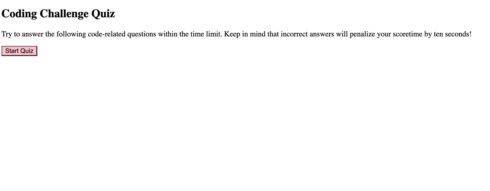
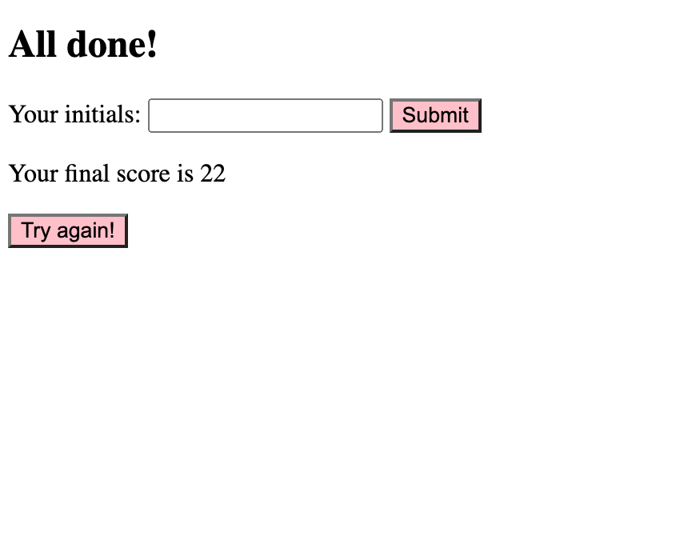

# <Code-Quiz>

## Description

My motivation for this project was to practice using new concepts that were taught in our class Web API unit. I got in a lot of practice using the Document Object Model in order to manipulate HTML using JavaScript. This application invites you to complete a quiz in 60 seconds, decrementing by 10 seconds when an answer is wrong. Your score is based on how much time you have left and allows you to save your score with your initials to a score board. I learned a lot about using functions and for loops in a project with a lot of steps. 

## Usage

When the game begins, click "Start Quiz" to begin.

The timer begins at 60 and the user is prompted to select an answer to a coding question. If the correct option is selected, "correct" is displayed and the next question is shown. If the wrong option is selected, "wrong" is displayed and the timer decrements by ten seconds. 

If the timer reaches 0 before all questions are answered, the users total points are 0, otherwise the users points are how many seconds were left when the quiz was completed. The final page displays the users score & prompts the user to enter there initials and click the submit button

After the user submits there score, the highscores page is displayed, which includes there initials and saved score, as well as that of other players.

## License

MIT License

## Features

Timer
Multiple choice questions

Saving user score

High-score page

## Deployed Link
